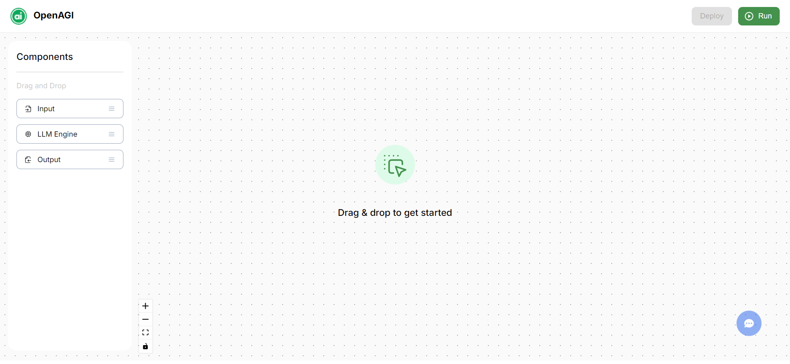
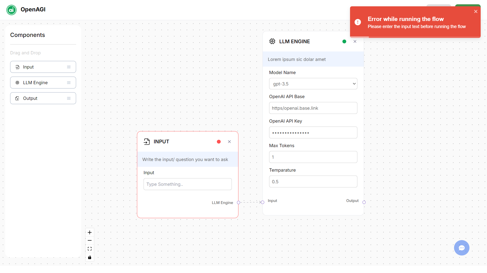
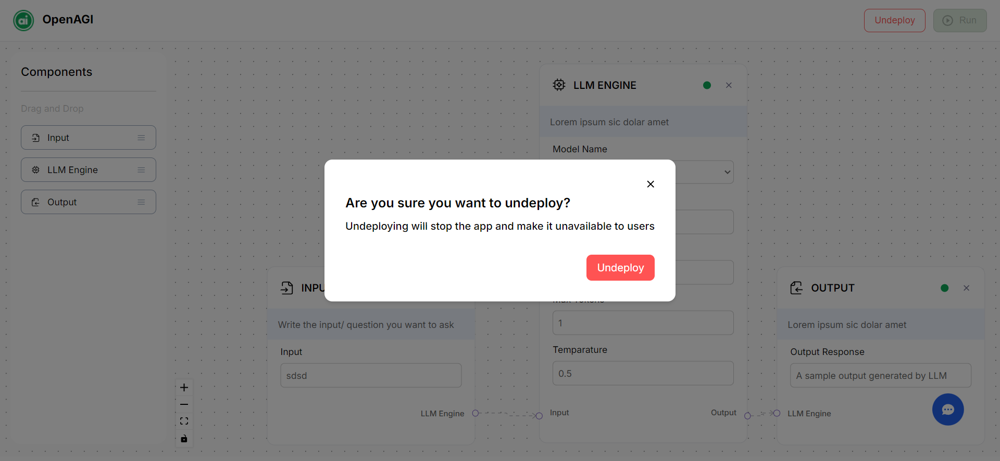
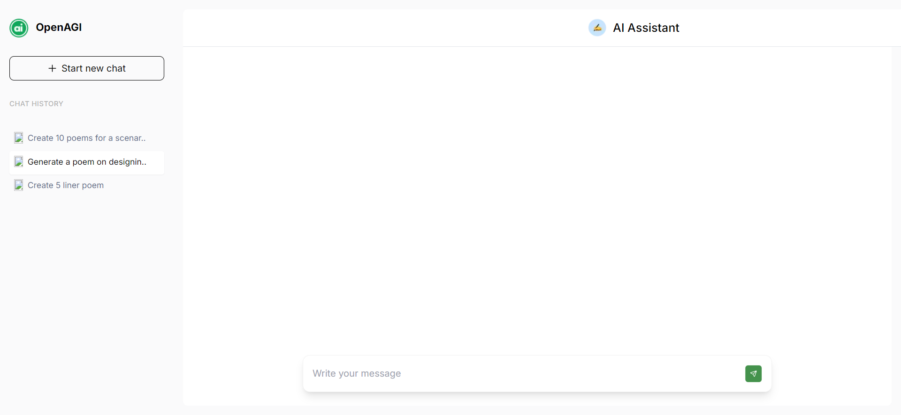
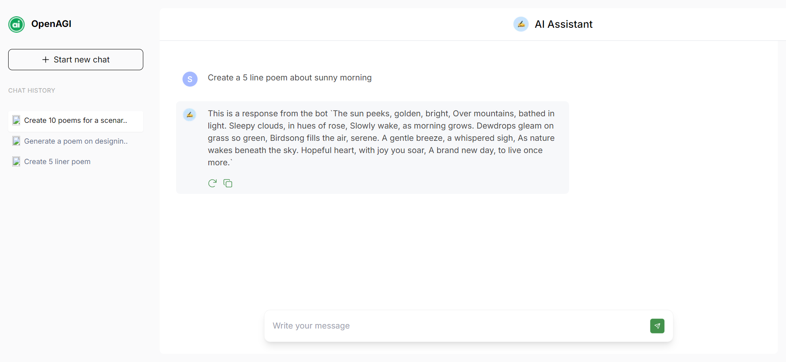

# AI-Powered Workflow and Assistant Interface



This project is an **AI-powered interface** designed to simulate intelligent interactions and dynamic workflows. The system allows users to communicate with an AI assistant, manage multiple conversation threads, and perform additional workflow-related tasks such as deploying/undeploying features, responding to system states, and maintaining contextual chat history.

---

## 📜 Table of Contents

- [Overview](#overview)
- [Features](#features)
- [Tech Stack](#tech-stack)
- [Screenshots](#screenshots)
- [Installation](#installation)
- [Developer Info](#-developer-information)
---

## 🧐 Overview

The **AI-Powered Workflow and Assistant Interface** is designed to handle interactions with an AI assistant, including managing conversations, handling user actions, and dynamically responding to various system states. The system integrates both chat functionality and broader AI-driven workflows, such as deploying models, managing configurations, and navigating between workflows.

### Key Objectives:
- Manage multiple AI chats simultaneously.
- Provide users with deployment/undeployment functionality.
- Use dynamic prompts and responsive actions within the workflow.
- Seamless state management with Zustand to track and update the application’s current state.

---

## ✨ Features

- **AI Chat Functionality:** Interact with the AI assistant through chat, with the ability to switch between multiple conversations dynamically.
- **Sidebar for Chat Navigation:** Easily switch between chats through a fixed sidebar, allowing users to select different conversation threads.
- **Deploy/Undeploy System:** The interface integrates deploy/undeploy buttons for managing workflows and system states.
- **Copy to Clipboard Feature:** Copy chat outputs with ease using a copy button next to each message.
- **Dynamic State Handling:** Use Zustand for efficient state management across various components like chat threads, deployment status, and user input tracking.

---

## 💻 Tech Stack

- **Frontend:** Next.js, React, Tailwind CSS for responsive styling.
- **State Management:** Zustand for managing global application states.
- **Toast Notifications:** React-toastify for alert and notification handling.

---

## 📸 Screenshots

Here are some key visuals of the application:
### 1. **Nodes Tab with Input Validation:** 


### 2. **Deploy/Undeploy Workflow Feature**


### 3. **Sidebar with Chat Selection**


### 4. **Chat Interface**



---

## 🚀 Installation

To get the project running locally, follow these steps:

1. **Clone the repository:**
   ```bash
   git clone https://github.com/giriyaram/aiplanet-assignment.git
   cd aiplanet-assignment
   ```
2. **Install dependencies:**

    ```bash
    npm install
    ```
3. **Start the development server:**
    ```bash
    npm run dev
    ```
4. **Open the browser and navigate to** http://localhost:3000.


---

## 👨‍💻 Developer Information

This project was developed by **[Giri Yaram]** in collaboration with **AI Planet**. Below is how you can reach out for questions, feedback, or contributions:

- **Name:** [Giri Yaram]
- **LinkedIn:** [linkedin.com/in/giri-yaram](https://www.linkedin.com/in/giri-yaram/)
- **GitHub:** [github.com/giriyaram](https://github.com/giriyaram/)


---

